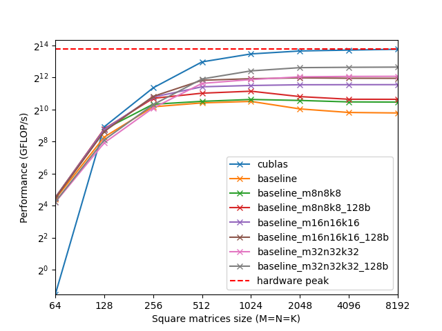

# CuTe Ampere DGEMM

<p align="center">
  
</p>

## Requirements
- CUDA TOOLKIT >= 12.9 (for nvcc and cublas)
- cutlass `git clone https://github.com/NVIDIA/cutlass.git`

## Usage
```shell
make baseline
./baseline > baseline.csv
./plot
```
